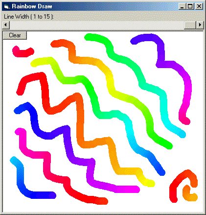



## Rainbow Drawing Tool

### Description

This is simple but really cool effect and a step over the normal pen tool (like in paintbrush). This pen draws in rainbow colours! Check it out...

Please vote and leave comments.
 
### More Info
 

             |
---                |---
**Submitted On**   |2002-03-01 18:30:28
**By**             |[Sunero Technologies](https://github.com/Planet-Source-Code/PSCIndex/blob/master/ByAuthor/sunero-technologies.md)
**Level**          |Beginner
**User Rating**    |5.0 (10 globes from 2 users)
**Compatibility**  |VB 6\.0
**Category**       |[Graphics](https://github.com/Planet-Source-Code/PSCIndex/blob/master/ByCategory/graphics__1-46.md)
**World**          |[Visual Basic](https://github.com/Planet-Source-Code/PSCIndex/blob/master/ByWorld/visual-basic.md)
**Archive File**   |[Rainbow\_Dr58535312002\.zip](https://github.com/Planet-Source-Code/sunero-technologies-rainbow-drawing-tool__1-32218/archive/master.zip)

